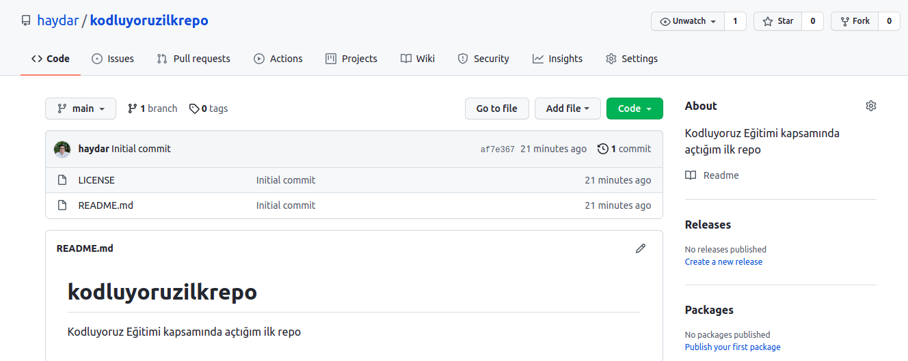

# Kodluyoruz İlk Repo
Bu repo [Kodluyoruz](https://www.kodluyoruz.org/) Front-end eğtiminde oluşturduğumuz ilk repo. İçerisinde bir adet README dosyası, bir adet de index.html barındırıyor.




## Installation 

Öncelikle prokeyi clonelayalım. 

`https://github.com/haydar/kodluyoruzilkrepo.git`

## Usage

Projeyi cloneladıktan sonra Visual Studio Code programında açınız.

Linux için; 

```SH
cd kodluyoruzilkrepo
code .
```

# Contributing 

Pull requestler kabul edilir. Büyük değişikliklede lütfen önce neyi değiştirmek isteinizi tartışmak için konu açınız.

## Licence 

[MIT](https://choosealicense.com/licenses/mit/)